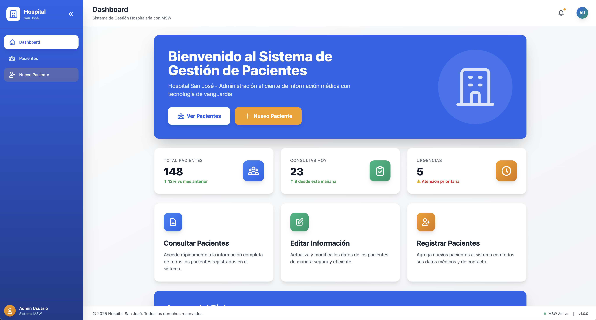
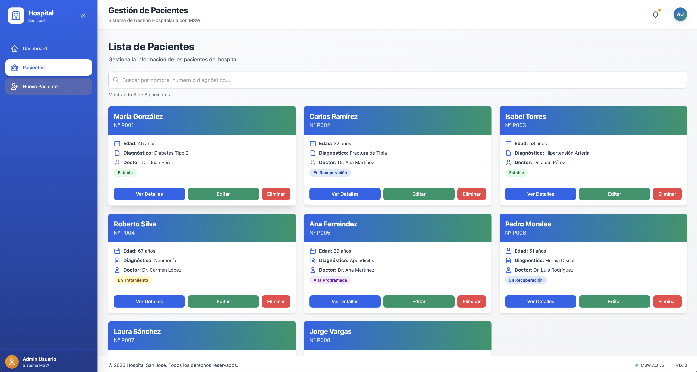
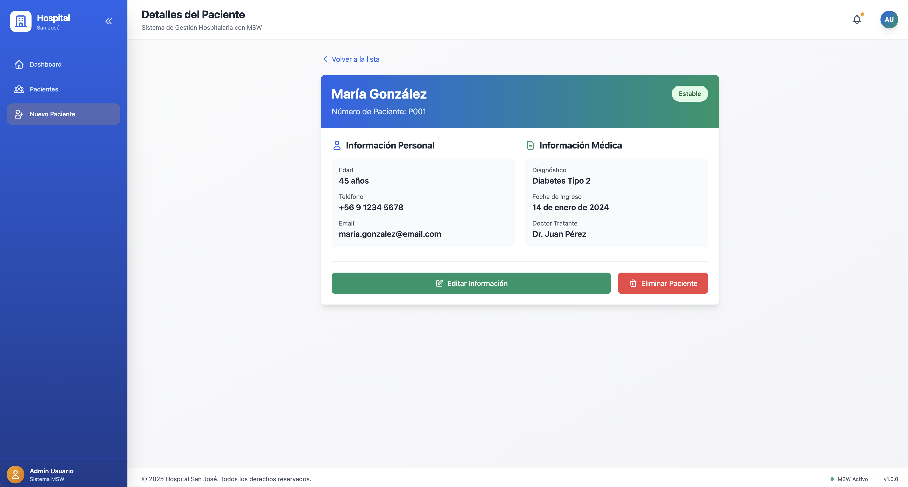
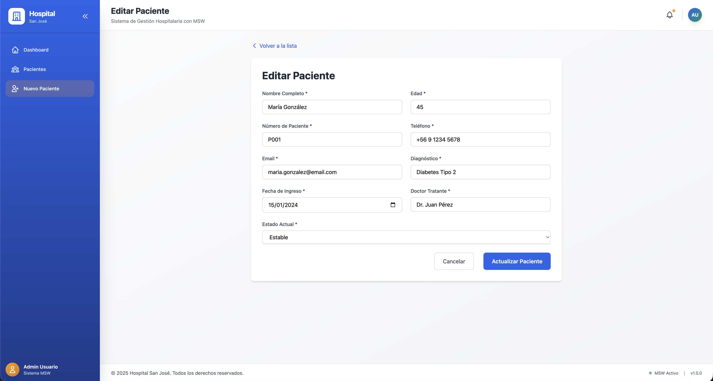
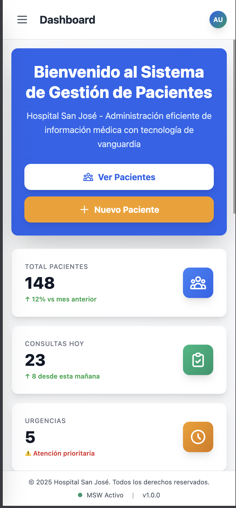

<div align="center">

# 🏥 Sistema de Gestión de Pacientes

### Aplicación web moderna para la administración hospitalaria

[](https://react.dev/)
[](https://vitejs.dev/)
[](https://reactrouter.com/)
[](https://tailwindcss.com/)
[](https://mswjs.io/)
[](./LICENSE)

### 🚀 [Ver Demo en Vivo](https://rodrigosanchezdev.github.io/hospital-patient-react-router-mock-rest/)

[Demo](https://rodrigosanchezdev.github.io/hospital-patient-react-router-mock-rest/) • [Características](#-características) • [Instalación](#-instalación) • [Uso](#-uso) • [Documentación](#-documentación) • [Licencia](#-licencia)

</div>

---

## 📋 Tabla de Contenidos

- [Demo](#-demo)
- [Acerca del Proyecto](#-acerca-del-proyecto)
- [Tecnologías](#-tecnologías)
- [Características](#-características)
- [Requisitos Previos](#-requisitos-previos)
- [Instalación](#-instalación)
- [Uso](#-uso)
- [Estructura del Proyecto](#-estructura-del-proyecto)
- [API](#-api)
- [Arquitectura](#-arquitectura)
- [Capturas de Pantalla](#-capturas-de-pantalla)
- [Roadmap](#-roadmap)
- [Contribuir](#-contribuir)
- [Licencia](#-licencia)
- [Autor](#-autor)

---

## � Demo

### 🔗 **Aplicación en vivo:** [https://rodrigosanchezdev.github.io/hospital-patient-react-router-mock-rest/](https://rodrigosanchezdev.github.io/hospital-patient-react-router-mock-rest/)

La aplicación está desplegada en GitHub Pages y está completamente funcional. Puedes:
- ✅ Ver la lista completa de pacientes
- ✅ Buscar pacientes en tiempo real
- ✅ Ver detalles completos de cada paciente
- ✅ Crear nuevos pacientes
- ✅ Editar información existente
- ✅ Eliminar pacientes
- ✅ Probar el diseño responsive en cualquier dispositivo

> **Nota:** La aplicación usa Mock Service Worker (MSW) para simular un backend REST, por lo que los datos se reinician al recargar la página.

---

## �🎯 Acerca del Proyecto

Sistema de gestión hospitalaria desarrollado con tecnologías web modernas, diseñado para proporcionar una interfaz intuitiva y eficiente para la administración de información de pacientes. La aplicación implementa un patrón de arquitectura limpia con separación de responsabilidades y utiliza Mock Service Worker para simular un backend REST completo.

### ✨ Highlights

- 🎨 **Diseño Profesional** - Interfaz moderna con sidebar colapsable y gradientes
- 📱 **100% Responsive** - Optimizado para móviles, tablets y desktop
- ⚡ **Rendimiento Optimizado** - Sistema de caché con TTL de 30s + Hot Module Replacement
- 🔒 **Arquitectura Escalable** - Separación de capas (UI, Servicios, Caché, Datos)
- 🎭 **Mock Service Worker** - Backend simulado sin necesidad de servidor real
- 🛡️ **Manejo Robusto de Errores** - Clase APIError con mensajes contextuales y retry mechanism
- 💾 **Estados de Carga Granulares** - Feedback visual específico para cada operación
- 🎨 **Tailwind CSS** - Estilos utility-first para desarrollo rápido

---

## 🛠️ Tecnologías

### Core

| Tecnología | Versión | Descripción |
|------------|---------|-------------|
|  | 19.0.0 | Biblioteca para construir interfaces de usuario |
|  | 7.2.2 | Build tool de nueva generación |
|  | 7.9.6 | Enrutamiento declarativo para React |

### Estilos

| Tecnología | Versión | Descripción |
|------------|---------|-------------|
|  | 3.4.0 | Framework CSS utility-first |
|  | 8.4.0 | Herramienta para transformar CSS |
|  | 10.4.0 | Plugin PostCSS para añadir prefijos de navegador |

### Testing & Mocking

| Tecnología | Versión | Descripción |
|------------|---------|-------------|
|  | Latest | Mock Service Worker para interceptar requests HTTP |

---

## 🚀 Características

### 📦 Gestión de Pacientes

- ✅ **Lista de Pacientes** - Vista en grid con tarjetas interactivas
- ✅ **Búsqueda en Tiempo Real** - Filtrado instantáneo por nombre
- ✅ **Detalle Completo** - Información médica detallada de cada paciente
- ✅ **Crear Paciente** - Formulario completo con validación
- ✅ **Editar Paciente** - Actualización de datos existentes
- ✅ **Eliminar Paciente** - Confirmación segura antes de borrar

### 🎨 Interfaz de Usuario

- ✅ **Sidebar Profesional** - Menú lateral colapsable con animaciones
- ✅ **Diseño Responsive** - Adaptado para móvil, tablet y desktop
- ✅ **Dashboard Informativo** - Estadísticas y métricas visuales
- ✅ **Paleta de Colores** - Blue (primario), Emerald (secundario), Amber (acentos)
- ✅ **Animaciones Suaves** - Transiciones y hover effects profesionales
- ✅ **Iconos SVG** - Iconografía consistente en toda la aplicación

### ⚙️ Funcionalidades Técnicas

- ✅ **SPA (Single Page Application)** - Navegación sin recargas de página
- ✅ **API RESTful Mock** - Endpoints completos con MSW
- ✅ **Sistema de Caché Inteligente** - Caché en memoria con TTL de 30 segundos para optimizar peticiones
- ✅ **Manejo Robusto de Errores** - Clase APIError personalizada con mensajes user-friendly por código HTTP
- ✅ **Estados de Carga Granulares** - Indicadores específicos para cada operación (guardando, eliminando, cargando)
- ✅ **Retry Mechanism** - Botón de reintentar con alternativas de navegación en caso de error
- ✅ **Arquitectura en Capas** - Servicios centralizados y componentes reutilizables
- ✅ **Estado Local Optimizado** - Gestión de estado con React Hooks y prevención de re-renders innecesarios
- ✅ **Hot Module Replacement** - Desarrollo con recarga instantánea
- ✅ **ES Modules** - Código moderno con import/export
- ✅ **Rutas Dinámicas** - Configuración automática para desarrollo y producción (GitHub Pages)

---

## 📋 Requisitos Previos

Antes de comenzar, asegúrate de tener instalado:

- **Node.js** >= 18.0.0
- **npm** >= 9.0.0 o **yarn** >= 1.22.0

Verifica las versiones instaladas:

```bash
node --version
npm --version
```

---

## 📥 Instalación

### 1️⃣ Clonar el Repositorio

```bash
git clone https://github.com/yourusername/hospital-patient-management.git
cd hospital-patient-management
```

### 2️⃣ Instalar Dependencias

```bash
npm install
```

O si prefieres yarn:

```bash
yarn install
```

### 3️⃣ Inicializar Mock Service Worker

```bash
npx msw init public/ --save
```

---

## 🎮 Uso

### Modo Desarrollo

Inicia el servidor de desarrollo con hot-reload:

```bash
npm run dev
```

La aplicación estará disponible en [http://localhost:5173](http://localhost:5173)

### Build para Producción

Genera una versión optimizada para producción:

```bash
npm run build
```

Los archivos optimizados se generarán en la carpeta `dist/`.

### Preview de Producción

Previsualiza la build de producción localmente:

```bash
npm run preview
```

---

## 📂 Estructura del Proyecto

```
hospital-patient-react-router-mock-rest/
├── 📁 public/
│   └── mockServiceWorker.js         # 🔧 Service Worker de MSW
│
├── 📁 src/
│   ├── 📁 components/
│   │   └── Layout.jsx               # 🎨 Layout principal con sidebar
│   │
│   ├── 📁 pages/
│   │   ├── Home.jsx                 # 🏠 Dashboard con estadísticas
│   │   ├── ListaPacientes.jsx       # 📋 Lista y búsqueda de pacientes
│   │   ├── DetallePaciente.jsx      # 👤 Vista detallada de paciente
│   │   └── EditarPaciente.jsx       # ✏️ Formulario crear/editar
│   │
│   ├── 📁 mocks/
│   │   ├── browser.js               # ⚙️ Configuración MSW browser
│   │   ├── handlers.js              # 🎯 Handlers REST API
│   │   └── data.js                  # 💾 Datos mock de pacientes
│   │
│   ├── 📁 services/
│   │   └── api.js                   # 🔌 Capa de servicios API
│   │
│   ├── App.jsx                      # 🗺️ Configuración de rutas
│   ├── main.jsx                     # 🚀 Entry point + MSW init
│   └── index.css                    # 🎨 Estilos globales Tailwind
│
├── 📄 tailwind.config.js            # ⚙️ Config Tailwind + colores
├── 📄 postcss.config.js             # ⚙️ Config PostCSS
├── 📄 vite.config.js                # ⚙️ Config Vite
└── 📄 package.json                  # 📦 Dependencies & scripts
```

---

## 🔌 API

### Endpoints Disponibles

Mock Service Worker intercepta las siguientes peticiones HTTP:

| Método | Endpoint | Descripción |
|--------|----------|-------------|
| `GET` | `/api/pacientes` | Obtener todos los pacientes |
| `GET` | `/api/pacientes/:id` | Obtener un paciente específico |
| `POST` | `/api/pacientes` | Crear un nuevo paciente |
| `PUT` | `/api/pacientes/:id` | Actualizar un paciente existente |
| `DELETE` | `/api/pacientes/:id` | Eliminar un paciente |

### Ejemplo de Respuesta

```json
{
  "id": "1",
  "nombre": "María González",
  "edad": 45,
  "numeroPaciente": "P-2024-001",
  "telefono": "+56 9 1234 5678",
  "email": "maria.gonzalez@email.com",
  "diagnostico": "Hipertensión arterial",
  "fechaIngreso": "2024-01-15",
  "doctorTratante": "Dr. Juan Pérez",
  "estadoActual": "Estable"
}
```

### Datos de Ejemplo

La aplicación incluye **8 pacientes de ejemplo** con información completa:
- ✅ Datos personales (nombre, edad, contacto)
- ✅ Información médica (diagnóstico, estado)
- ✅ Datos administrativos (número de paciente, doctor)
- ✅ Fechas de ingreso y seguimiento

---

## 🏗️ Arquitectura

### Capa de Presentación (UI)
```
Components → Pages → Layout
```
- **Components**: Componentes reutilizables (Layout, Sidebar)
- **Pages**: Vistas principales de la aplicación
- **Layout**: Estructura común con navegación

### Capa de Servicios
```
Pages → API Service → Cache Layer → MSW Handlers
```
- **API Service** (`src/services/api.js`): Centraliza todas las llamadas HTTP
- **Cache Layer**: Sistema de caché en memoria con invalidación automática
- **MSW Handlers**: Intercepta y simula respuestas del backend

### Sistema de Caché

El proyecto implementa un sistema de caché inteligente:

```javascript
// Caché en memoria con TTL de 30 segundos
const cache = {
  pacientes: null,
  lastFetch: null,
  CACHE_DURATION: 30000
};
```

**Características:**
- ✅ **Cache hits**: `getAll()` usa caché si es válido (< 30s)
- ✅ **Búsqueda optimizada**: `getById()` busca en caché antes de hacer fetch
- ✅ **Invalidación automática**: Create/Update/Delete limpian el caché
- ✅ **Force refresh**: Opción `getAll(true)` para forzar recarga
- ✅ **Logs detallados**: Console logs de cache hits/misses

### Manejo de Errores

Sistema robusto con clase personalizada `APIError`:

```javascript
class APIError extends Error {
  constructor(message, status, details) {
    super(message);
    this.status = status;
    this.userMessage = getUserFriendlyMessage(status);
  }
}
```

**Características:**
- ✅ **Mensajes contextuales** por código HTTP (400, 401, 403, 404, 500, 503)
- ✅ **Interfaz de error mejorada** con iconos y colores semánticos
- ✅ **Botón "Reintentar"** con funcionalidad completa
- ✅ **Soluciones sugeridas** específicas por tipo de error
- ✅ **Navegación alternativa** (botón "Ir al inicio")

### Estados de Carga

Indicadores granulares por operación:

- 🔄 **Loading inicial**: Spinner mientras MSW se inicializa
- 💾 **Guardando**: Estado específico en formularios
- 🗑️ **Eliminando**: Feedback visual en botones delete
- 🔍 **Cargando lista**: Spinner en lista de pacientes
- 🔒 **Botones deshabilitados**: Previene clicks durante operaciones

### Flujo de Datos
```
User Action → Component → API Service → Cache Check → MSW → Response → State Update → Re-render
                                 ↓                                    ↓
                            Cache Hit (return)              Cache Invalidation (CUD)
```

---

## 📸 Capturas de Pantalla

### 🖥️ Vista Desktop

<div align="center">

#### Dashboard Principal

*Dashboard con estadísticas en tiempo real y sidebar expandido*

#### Lista de Pacientes

*Grid de tarjetas con búsqueda en tiempo real*

#### Detalle de Paciente

*Vista completa con información médica detallada*

#### Formulario de Edición

*Formulario completo con validación para crear/editar pacientes*

</div>

### 📱 Vista Mobile

<div align="center">

#### Menú Responsive

*Menú hamburguesa y sidebar flotante con overlay*

#### Dashboard Móvil

*Dashboard optimizado para dispositivos móviles*

</div>

### 💡 Características Visuales

- ✅ **Sidebar Colapsable** - Se adapta automáticamente según el dispositivo
- ✅ **Animaciones Suaves** - Transiciones fluidas en todas las interacciones
- ✅ **Gradientes Profesionales** - Paleta de colores consistente
- ✅ **Iconografía Clara** - SVG icons para mejor rendimiento
- ✅ **Cards Interactivas** - Hover effects y sombras dinámicas
- ✅ **Responsive Grid** - Se adapta de 1 a 3 columnas según pantalla

---

## 🗺️ Roadmap

- [ ] Autenticación de usuarios
- [ ] Roles y permisos (admin, doctor, enfermera)
- [ ] Historial médico completo
- [ ] Exportar reportes a PDF
- [ ] Notificaciones push
- [ ] Modo oscuro
- [ ] Integración con backend real
- [ ] Tests unitarios y E2E

---

## 🤝 Contribuir

Las contribuciones son bienvenidas y apreciadas. Si deseas contribuir:

1. Fork el proyecto
2. Crea una rama para tu feature (`git checkout -b feature/AmazingFeature`)
3. Commit tus cambios (`git commit -m 'Add: nueva característica'`)
4. Push a la rama (`git push origin feature/AmazingFeature`)
5. Abre un Pull Request

---

## 📄 Licencia

Este proyecto está bajo la Licencia MIT. Consulta el archivo [LICENSE](LICENSE) para más detalles.

---

## 👨‍💻 Autor

<div align="center">

### Rodrigo Sánchez

[](mailto:rodrigo@sanchezdev.com)
[](https://sanchezdev.com)
[](https://linkedin.com/in/rodrigosanchez)
[](https://github.com/rodrigosanchez)

**Desarrollador Fullstack Senior** especializado en React Vite.

</div>

---

<div align="center">

### ⭐ Si te gustó este proyecto, dale una estrella ⭐

**Hecho con ❤️ por Rodrigo Sánchez**

[⬆ Volver arriba](#-sistema-de-gestión-de-pacientes)

</div>


